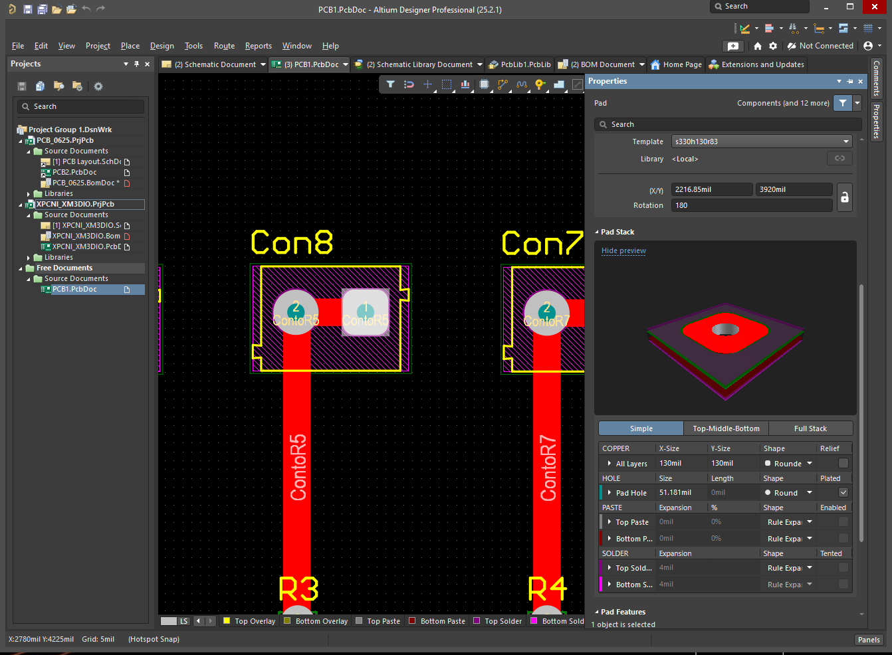

# Altium - Designing with the CNC in mind
**I am not doing a full altium "how to" tutorial, however there are some things to keep in mind**

## Schematic 
### OverView: 
Creating the schematic is simple and not much needs to be taken into consideration for later steps. If this process isn't familiar to you, there are plenty of tutorials out there. Altium has decent videos for the design process.

Tips:
* Label nets as much as possible - I did not do this for my first PCB and it didnt make all that much as the board was so simple, but in the future, keep that in mind. 
* Use specific components, and not the generic Altium components - the generic ones can create problems when updating to PCB Doc
  

## PCB Doc 
### OverView:
The PCB Doc is where layout and traces are created, which means that this has more effect on your final product. Sizing is very important and varies from if you are just ordering off of PCB Way. By using the 3018, there is more variation in cut sizes, so we want to make sure the traces actually exist in the final product. 

Tips
* TRACK WIDTH: Go to Design>Rules...>Routing>Width and make the traces about 50 - 70 mils wide (this is pretty wide for most PCB's, if you can go a little smaller without losing the traces, go for it) - therefore the traces won't dissapear once the CNC carves into the copper.
* PAD SIZE: This is a lot slower and more manual. To make the process a little easier, go to PCB Filter, and type in "IsPad" and "InAnyComponent". This allows you to only click on the pads and only the pads. Make sure the pads are visibly larger than the traces. By doing so, the CNC will leave enough room for soldering and drilling the holes.

> above
* GROUND PLANE: This board was so simple, it didn't need a ground plane exactly. However, using the 'line' tool will create separation from the rest of the board by removing copper in the CNC process. Adding the ground plane can create complications if you need more seperation from traces and the rest of the board. If a ground plane is needed, go to Design>Rules...>Clearance and go to "Advanced". A table pops up and change the Copper row to adjust clearance between tracks, pads etc. from the copper plane. You can play around with this and adjust as fit. 

## Transferring to FlatCAM
### OverView:
To move from Altium to FlatCAM, you need to export your board. To do so, go to File>Fabrication Outputs> and a sidebar should pop up. You will want to create "Gerber X2 Files" for the pads and traces, and "NC Drill Files" for the component holes. Save and number these as you so choose. I've had to go back and forth from candle to Altium to change the PCB layout and sizings, so numbering is important so you know what version you're using. 

