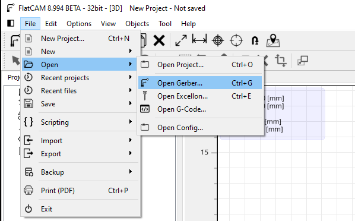
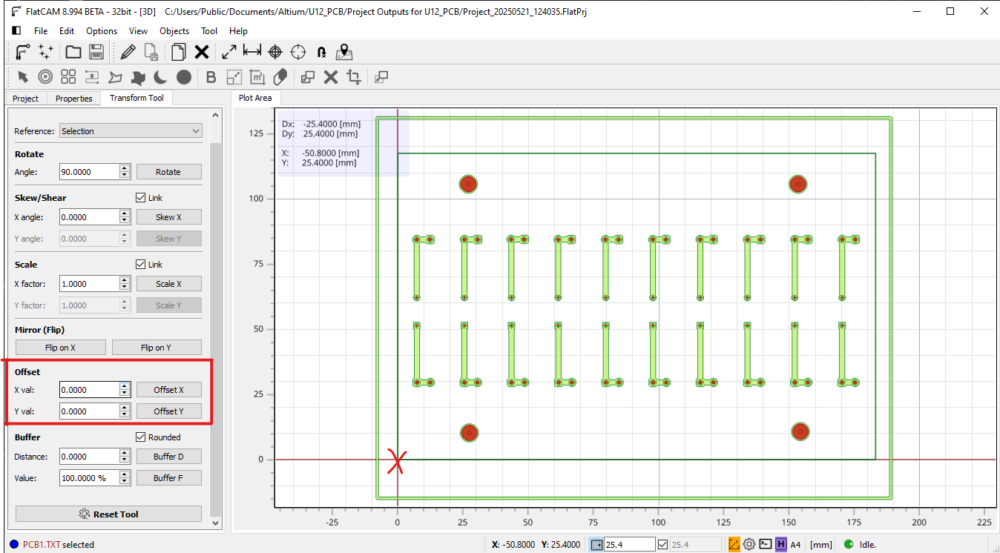

# FlatCAM

First, go to File>Open>Open Gerber... and find the Gerber X2 File saved from Altium. You should only need Copper Signal 1 (and 2 if you have a bottom layer), and Profile. Then to open the drill file, repeat the last step, except click on Excellon... and choose filename.TXT. 

> above: here is what your files should look like

*Hint: If you need to change your x-y axis, select all of your files, then choose Options>Object Transform and adjust the Offset values to adjust where the files are in relation to the axis. See image below*

