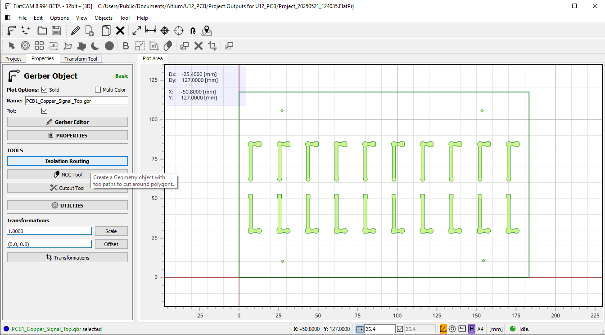

# FlatCAM

## Opening your files
First, go to File>Open>Open Gerber... and find the Gerber X2 File saved from Altium. You should only need Copper Signal 1 (and 2 if you have a bottom layer), and Profile. Then to open the drill file, repeat the last step, except click on Excellon... and choose filename.TXT. 

> above: here is what your files should look like

If you need to change your x-y axis, select all of your files, then choose Options>Object Transform and adjust the Offset values to adjust where the files are in relation to the axis. I used the offset to place the inner green corner on the axis, instead of the outer green corner. 

## Creating the Routing and Drill files
Go to Copper Signal 1 (or at least the file with your main traces) and click on Isolation Routing

A sidebar opens up with different options and this will create the "geometry" of your board. This is the in between from the Altium Gerber to the CNC files
* Tool Diameter: Mattwach has a better description for this, but choosing the V tool (even though the standard blades are V) causes problems, and you can't choose the depth the machine cuts, **at least with my version of FlatCAM.** I had so many problems, so I finally just went with C1 (i'm not sure about the others, they might be fine - I haven't played around with that setting exactly). Choose the diameter that you want the final cuts to be - I usually go with 0.3mm which gives plenty of clearance from the rest of the board. If you have a ground plane, this is where it becomes a problem. Despite choosing a 0.3mm wide cut, the ground plane can make this smaller, and not allow your cut outside a certain range. You can change clearance in Altium between a plane and traces, but expect to go through multiple iterations with Altium and CNC-ing the board. 
* Passes: This is how many times the router passes through. I generally go with 3 or 4 to make sure that I get the clearance I want and all the copper removed. 
* Overlap: A higher overlap will overlap the cuts more and also ensure no copper is left behind - set this to 20 - 25% when doing multiple passes.
* Generate Geometry: When you're done, click generate geometry, and it will create filename.grbr_iso_combined 
  

From there, we create the actual CNC file. *Ignore some of the parameters set in the picture shown, this is an older file I'm using for an example*
* Cut: Set this as 0.05mm. Ideally you won't need to go any deeper, but I've had times where the heightmap was innaccurate and the copper isn't being carved away. *Generally a range of .05 to 0.15mm is normal. Any deeper and you most likely have a heightmap and bowing issue with the copper. This is a large PCB so there is naturally more variation in the levels of the copper, and air pockets sometimes form between the cutting board and copper.*
* Travel Z: It's good to set this a little lower, around 2 to 5mm. Too low, and you could hit the copper below on accident, and if it's too high, the carving takes longer. 
* Feed rate XY: This can be set around 120 - 240 mm/min. By going with a slower cut rate, breaks in your blade are less likely. However, going 120 is overkill, as it just takes too long for the whole board to be cut out.
* Feed Rate Z: Keep this at about 60 mm/min, this will keep the blade from snapping immediately as it starts carving.
* Spindle Speed: Put this at 10000, because the 3018 is a cheaper machine, the speed isn't exact. Trust that it's very fast and that it works for this process. 

