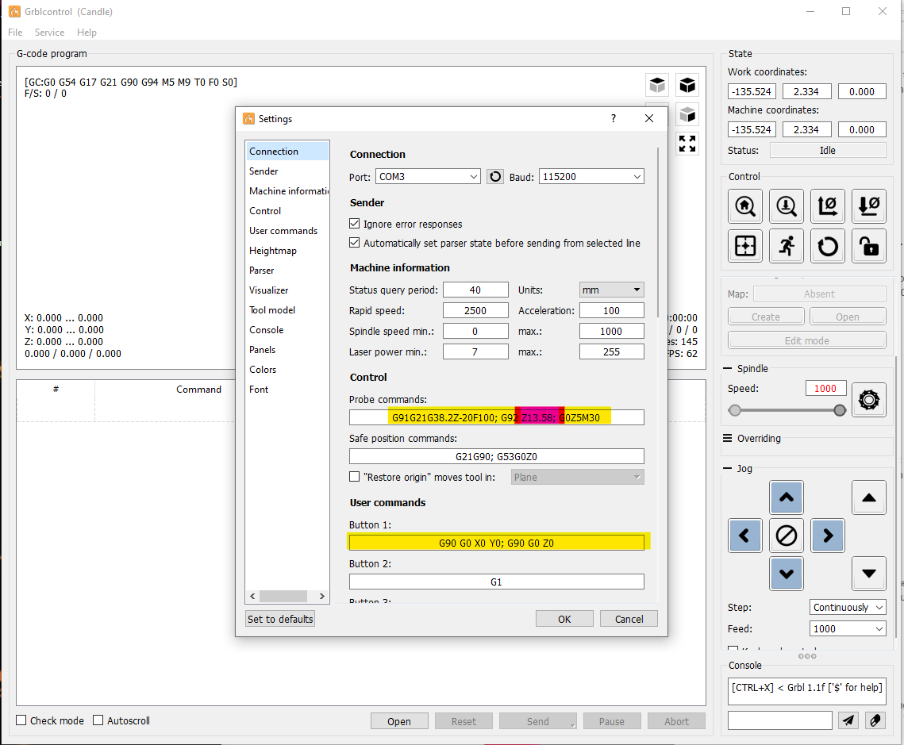

## Grbl_Candle & Carving 

> [!NOTE]
> Pay close attention to each step you take. It's easy to make little mistakes that un-zero the board. 

### Setting up before Setting Up
Before you begin, watch [this video](https://www.youtube.com/watch?v=u4Mcjz7IP10&t=16s) - particularly the z probe and x-y calibration - to create some helpful settings in Candle for the machine. It is also linked in other resources.

My Candle Settings

> The yellow sections aren't specific to the machine I'm using, and can be directly copy pasted.
> The pink section is the measurement of the z-probe - I used a set of calipers to get an accurate measurement in milimeters, and put that into these settings.
 

### Setting up

