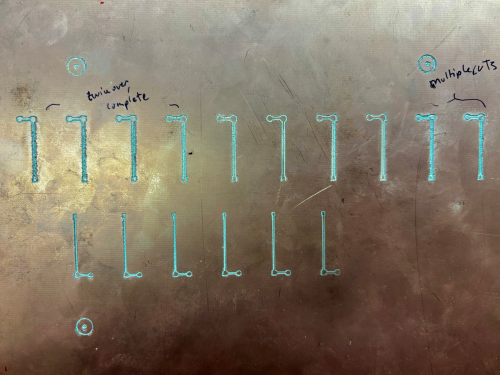

# PCB Creation - 3018 Genmitsu CNC

## Purpose
This is documentation from UW-Milwaukee - Center for Sustainable Electrical Energy Systems (SEES) and Microgrid Storage - in order to provide a (somewhat) step by step process for making in house PCB's. 

The PCB in this documentation is very simple. We are integrating NI Modules into the cabinets that control the Microgrid, that read current and voltage sensors. All the PCB is doing is running the NI module and sensor on one end across a 100* ohm resistor, and into two 15 VDC converters. The design is simple, however little things create problems when using a cheaper machine like the 3018 CNC.  

> above: test board with too thin traces and uneven depth

Moreover, I will be providing some of the errors I made in this process to avoid repetitive mistakes, design errors, and unusable boards

## Process
* [Altium](./altium.md)
* [FlatCam](./flatcam.md)
* [Candle](./Grbl_candle.md)\
and the machining process using the [3018 Genmitsu CNC]

